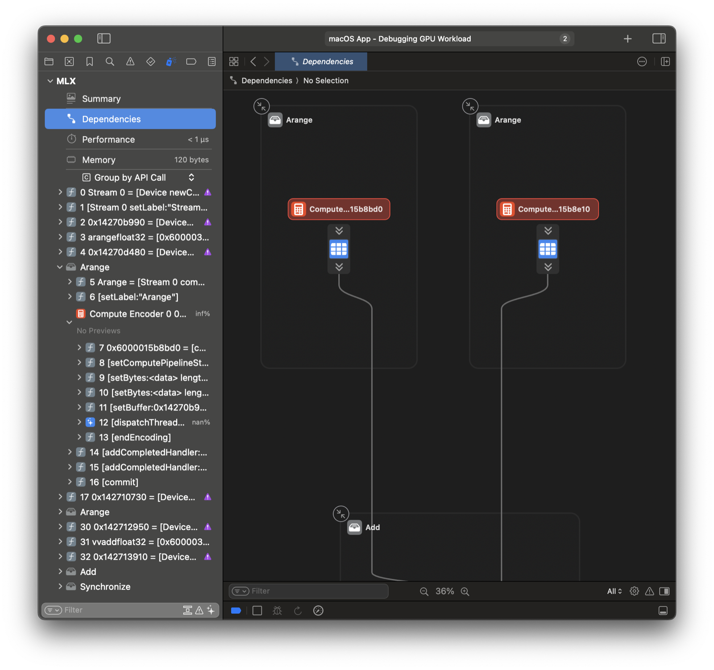
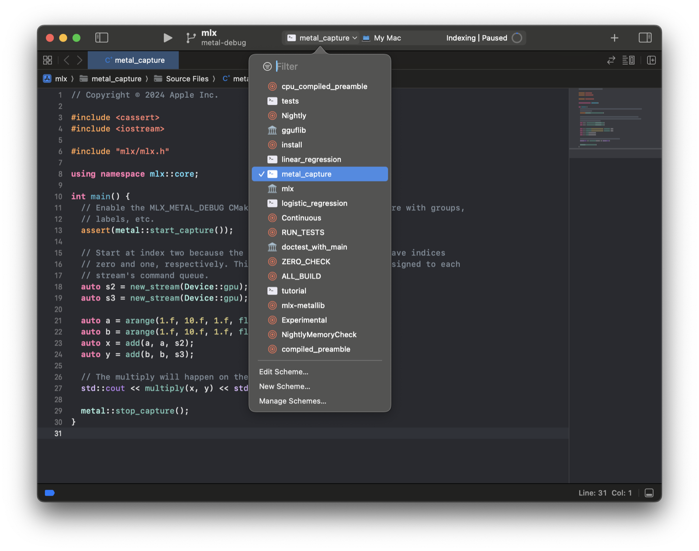

Metal Debugger
==============

Profiling is a key step during performance optimization. While tracking total
runtime can be effective, sometimes it's necessary to dive deep into GPU
compute.

MLX provides a couple mechanisms to improve the Metal debugger workflow. The
``MLX_METAL_DEBUG`` build option:

* Records source during Metal compilation, making source inspectable while
  debugging.
* Labels Metal objects such as command queues, improving capture readability.

The ``metal::start_capture`` function initiates a capture of all MLX GPU work in
a convenient manner.

.. code-block:: C++

    int main() {
        metal::start_capture("/Users/Jane/Developer/MLX.gputrace");

        auto a = arange(10.f, 20.f, 1.f, float32);
        auto b = arange(30.f, 40.f, 1.f, float32);
        auto c = add(a, b);

        eval(c);

        metal::stop_capture();
    }

The resulting GPU trace can be opened in Xcode and replayed. The `Dependencies`
view offers a great overview of all operations. See the `Metal debugger
documentation`_ for more information about the debugger.

Xcode Workflow
--------------

You can skip saving to a path by running within Xcode. For example, we can
generate an Xcode project for MLX using CMake.

.. code-block::

    mkdir build && cd build
    cmake .. -DMLX_METAL_DEBUG=ON -G Xcode
    open mlx.xcodeproj

Select the ``metal_capture`` example schema and run.

.. _`Metal debugger documentation`: https://developer.apple.com/documentation/xcode/metal-debugger